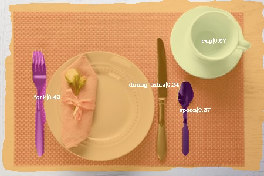

English | [简体中文](README_ch.md)

# Pytorch solov2 project
This code is a partial code extracted from the original code of the official author of SOLOV2 (the part of the lightweight implementation of SOLOV2_LIGHT), which does not rely on MMDetetion and MMCV. It is still relatively simple and has a lot of shortcomings to be improved. 

official code： https://github.com/WXinlong/SOLO       
paper： https://arxiv.org/abs/2003.10152 

## shortages
1、Only supports Resnet18, Resnet34 backbone to train.   
2、Multi GPU parallel training is not supported.   
3、Incomplete configuration items for training and testing.     

## Install
python 3.6+     
pip install torch==1.5.1  torchvision==0.6.1   #Higher versions of PyTorch also tested OK         
pip install pycocotools      
pip install numpy   
pip install scipy    
cd pytorch_solov2/      
python setup.py develop      #*Install the original FocalLoss of SoloV2*

**2021-05-17 update**    
Completely remove the dependency on MMCV

**2020-10-13 update**          
Improve the evaluation code, save it as the picture after instance segmentation, and add video test code.    

**2020-07-23update**    
The implementation of FocalLoss in the latest version of MMCV-Full is different from that in the original SOLO version (the processing label of the background class is different). If the MMCV-Full FocalLoss is used for training, although the loss is reduced, the actual prediction is not accurate.

So replace it with the original FocalLoss implementation. 
```
python setup.py develop
```
After the replacement, retraining, loss and prediction are normal.


 ## Test Images 
      
     




## train

After configuring the items in the config.py，run command
```Python
python train.py  
```
### config.py 
- **if use COCO dataset**    
```
coco2017/
├── annotations
├── train2017
└── val2017
```
in 'data' path run command:
```
ln -s /path/coco2017 coco    
```
modify the 'coco2017_dataset' item in 'config.py' , for example： 
```Python
coco2017_dataset = dataset_base.copy({
   'name': 'COCO 2017',
    'train_prefix': './data/coco/',
    'train_info': 'annotations/instances_train2017.json',
    'trainimg_prefix': 'train2017/',
    'train_images': './data/coco/',

    'valid_prefix': './data/coco/',
    'valid_info': 'annotations/instances_val2017.json',
    'validimg_prefix': 'val2017/',
    'valid_images': './data/coco/',

    'label_map': COCO_LABEL_MAP

})
```

- **if use casia-SPT_val dataset in this repo**  
```python 
casia_SPT_val = dataset_base.copy({
    'name': 'casia-SPT 2020',   #dataset's name 
    'train_prefix': './data/casia-SPT_val/val/',   #dataset path
    'train_info': 'val_annotation.json',           #label file
    'trainimg_prefix': '',
    'train_images': './data/casia-SPT_val/val/',   
    
    'valid_prefix': './data/casia-SPT_val/val/',
    'valid_info': 'val_annotation.json',
    'validimg_prefix': '',
    'valid_images': './data/casia-SPT_val/val',

    'label_map': COCO_LABEL_MAP
})
```
- use casia_SPT_val dataset, set backbone resnet18_backbone, batchsize is (batchsize=imgs_per_gpu*workers_per_gpu) 

```python
solov2_base_config = coco_base_config.copy({
    'name': 'solov2_base', 
    'backbone': resnet18_backbone,              #backbone
    # Dataset stuff
    'dataset': casia_SPT_val,
    'num_classes': len(coco2017_dataset.class_names) + 1,
    'imgs_per_gpu': 6,
    'workers_per_gpu': 2,
    'num_gpus': 1,                       #only support single GPU for now

```
- Complete Example Settings in 'data/config.py' 
```python
# ----------------------- SOLO v2.0 CONFIGS ----------------------- #

solov2_base_config = coco_base_config.copy({
    'name': 'solov2_base', 
    'backbone': resnet18_backbone,
    # Dataset stuff
    'dataset': casia_SPT_val,
    'num_classes': len(coco2017_dataset.class_names) + 1,
     #batchsize=imgs_per_gpu*workers_per_gpu
    'imgs_per_gpu': 4,
    'workers_per_gpu': 2,
    'num_gpus': 1,

    'train_pipeline':  [
        dict(type='LoadImageFromFile'),                                #read img process 
        dict(type='LoadAnnotations', with_bbox=True, with_mask=True),     #load annotations 
        dict(type='Resize',                                              #Multiscale training, then select a size from the size behind
            img_scale=[(768, 512), (768, 480), (768, 448),
                    (768, 416), (768, 384), (768, 352)],
            multiscale_mode='value',
            keep_ratio=True),
        dict(type='RandomFlip', flip_ratio=0.5),                    #Stochastic inversion, prob=0.5 
        dict(type='Normalize', mean=[123.675, 116.28, 103.53], std=[58.395, 57.12, 57.375], to_rgb=True),    #normallize                 
        dict(type='Pad', size_divisor=32),                                # SOLOV2 has requirements on the size of network input, and the image size needs to be a multiple of 32
        dict(type='DefaultFormatBundle'),                                #将数据转换为tensor，为后续网络计算
        dict(type='Collect', keys=['img', 'gt_bboxes', 'gt_labels', 'gt_masks'], meta_keys=('filename', 'ori_shape', 'img_shape', 'pad_shape',
                            'scale_factor', 'flip', 'img_norm_cfg')),   
    ],

    'test_cfg': None,

    # learning policy
    'lr_config': dict(policy='step', warmup='linear', warmup_iters=500, warmup_ratio=0.01, step=[27, 33]),
    'total_epoch': 36,               #set epoch number for train 

    # optimizer
    'optimizer': dict(type='SGD', lr=0.01, momentum=0.9, weight_decay=0.0001),  
    'optimizer_config': dict(grad_clip=dict(max_norm=35, norm_type=2)),   #Gradient balance strategy
    'resume_from': None,    #resume from a checkpoing file,  start epoch 1  if None
    'epoch_iters_start': 1,    #start epoch number

    'test_pipeline': [
        dict(type='LoadImageFromFile'),
        dict(
            type='MultiScaleFlipAug',
            img_scale=(768, 448),
            flip=False,
            transforms=[
                dict(type='Resize', keep_ratio=True),
                dict(type='RandomFlip'),
                dict(type='Normalize', mean=[123.675, 116.28, 103.53], std=[58.395, 57.12, 57.375], to_rgb=True),
                dict(type='Pad', size_divisor=32),
                dict(type='ImageToTensor', keys=['img']),
                dict(type='Collect', keys=['img']),
            ])
    ],

    'test_cfg': dict(
                nms_pre=500,
                score_thr=0.1,
                mask_thr=0.5,
                update_thr=0.05,
                kernel='gaussian',  # gaussian/linear
                sigma=2.0,
                max_per_img=30)
})
```

- start trainning

```Python
python train.py  
```

## eval
Modify the last code of the 'eval.py' code based on your dataset
```Python 
# valmodel_weight     model weight
# data_path           images path
# benchmark         whether write result json to file 
# test_mode 
# save_imgs         whether save result image to results path
eval(valmodel_weight='pretrained/solov2_448_r18_epoch_36.pth',data_path="data/casia-SPT_val/val/JPEGImages", benchmark=False, test_mode="images", save_imgs=False)
#eval(valmodel_weight='pretrained/solov2_448_r18_epoch_36.pth',data_path="cam0.avi", benchmark=False, test_mode="video")
```
run eval.py
```Python
python eval.py
```


## weight files

**backbone pretrained weights**      
from torchvision, prtrained weight in imagenet  
```shell
resnet18: ./pretrained/resnet18_nofc.pth
resnet34:  ./pretrained/resnet18_nofc.pth
``` 

**solov2 light weight trained on coco2017**  
```shell
SOLOv2_Light_448_R18_36: ./pretrained/solov2_448_r18_epoch_36.pth 
SOLOv2_Light_448_R34_36:  https://drive.google.com/file/d/1F3VRX1nZPnjKrzAC7Z4EmAlwmG-GWF8u/view?usp=sharing
or
链接：https://pan.baidu.com/s/1MCVkAeKwTua-m9g1NLyRpw 
提取码：ljkk 
复制这段内容后打开百度网盘手机App，操作更方便哦

```


## Other 

1.该网络训练时会将resnset的第一个卷积层和第一个stage的BasicBlock卷积层freeze,并且训练时resnet中的bn层都设置为eval()模式   
2. The inputs of solov2 require multiples of 32 in both length and width, depending on the grid he is drawing, and other dimensions may be impossible to calculate.      
3. Solov2 is relatively simple on the whole, with no strange operations or layers. There is a convolution operation in post-processing (the convolution core is learned during training, and it takes little time to compute on GPU). Matrix_NMS also takes little time. After this part of processing, the output of the network is:
 ```
mask [nums, height, weight]    #masks's number， 
cls [nums]                     #class of masks
scores [nums]                  #score of masks
 ```
 

## Reference
https://github.com/WXinlong/SOLO   
https://github.com/open-mmlab/mmdetection   
https://github.com/open-mmlab/mmcv  


